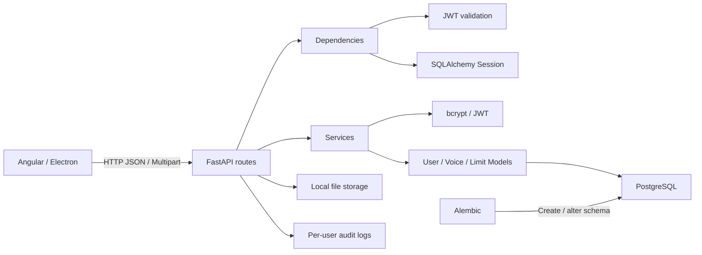

# 01. Tổng quan và kiến trúc hệ thống

Tài liệu này mô tả các mục chính từ 1 đến 4:

1. Tổng quan hệ thống.
2. Kiến trúc source code.
3. Luồng xử lý request.
4. Ánh xạ kiến trúc với các hàm trong source.

Tài liệu liên quan:

- [02_LOGIC_API.md](./02_LOGIC_API.md)
- [03_CAU_TRUC_DATABASE.md](./03_CAU_TRUC_DATABASE.md)

## 1. Tổng quan hệ thống

Backend phục vụ ứng dụng Angular/Electron về Text-to-Speech, Voice Clone,
Voice Design và Generate Voice.

Các chức năng hiện có:

- Đăng ký, đăng nhập và đổi mật khẩu.
- Xác thực bằng JWT access token.
- Kiểm tra quyền truy cập từng màn hình.
- Tạo, xem, tìm kiếm, phân trang, đổi tên và xóa voice của từng tài khoản.
- Upload và stream audio Clone Voice.
- Kiểm tra quota Voice Clone và Voice Design ở server.
- Quản lý trạng thái, quyền và limit của user bằng CLI.
- Ghi audit log riêng theo từng user cho mọi HTTP request.
- Xác thực quản trị độc lập với tài khoản người dùng.

PostgreSQL lưu tài khoản, quyền và giới hạn. File upload được ghi vào thư mục
local cấu hình bởi `UPLOAD_DIR`, không lưu trực tiếp trong database.



## 2. Kiến trúc source code

```text
app/
  main.py                 FastAPI, CORS, health check, DB error handler
  api/
    deps.py               DB session và xác thực JWT
    router.py             Ghép router dưới prefix /api
    routes/
      auth.py             Auth endpoints
      admin.py            Admin login và API quản trị
      voices.py           Voice endpoints
  core/
    audit.py              Rotating JSON audit log theo user
    config.py             Đọc cấu hình .env
    security.py           bcrypt và JWT
  db/
    base.py               SQLAlchemy metadata cho Alembic
    session.py            Engine, SessionLocal, get_db
  models/
    base.py               Declarative Base và timestamps
    user.py               Model users
    user_admin.py         Model tài khoản quản trị độc lập
    voice.py              Model voices và các bảng limit
  schemas/
    auth.py               Auth request/response
    common.py             Response dùng chung
    voice.py              Voice response
  services/
    auth_service.py       Logic tài khoản và quyền
    admin_service.py      Logic dashboard và quản trị dữ liệu
    voice_service.py      CRUD, ownership, validation và quota
  utils/
    files.py              Lưu/xóa/resolve file audio local
alembic/
  env.py                  Cấu hình migration
  versions/               Các migration
scripts/
  create_user.py          CLI quản trị user
  create_admin.py         CLI tạo/cập nhật admin độc lập
tests/                    Test API và business logic
```

### Trách nhiệm từng tầng

| Tầng | Trách nhiệm |
| --- | --- |
| `api/routes` | Nhận request, gọi service, chọn HTTP status |
| `api/deps` | Cấp DB session và xác thực JWT |
| `schemas` | Validate input, định dạng output |
| `services` | Business logic và transaction |
| `models` | Ánh xạ ORM với bảng PostgreSQL |
| `db` | Engine và SQLAlchemy session |
| `core` | Cấu hình, bcrypt và JWT |
| `utils` | Tiện ích độc lập như lưu file |

## 3. Luồng xử lý một request

Ví dụ request cần đăng nhập:

1. FE gửi request với:

   ```http
   Authorization: Bearer <access_token>
   ```

2. `app/api/router.py` định tuyến request.
3. `DbSession` gọi `get_db()` để tạo SQLAlchemy session.
4. `CurrentUser` gọi `get_current_user()`:
   - Đọc Bearer token.
   - Giải mã và xác minh JWT.
   - Lấy user ID từ claim `sub`.
   - Truy vấn user trong PostgreSQL.
   - Từ chối nếu user không tồn tại hoặc chưa active.
5. Route gọi service nghiệp vụ.
6. Service đọc hoặc cập nhật SQLAlchemy model.
7. Pydantic chuyển dữ liệu thành JSON response.
8. Session được đóng khi request kết thúc.

## 4. Ánh xạ kiến trúc với các hàm

### 4.1 `app/main.py`

#### `database_exception_handler(_, exc)`

- Bắt `SQLAlchemyError` chưa được xử lý.
- Ghi traceback vào log.
- Trả HTTP `503` khi database mất kết nối hoặc schema chưa migration.

#### `health()`

- Endpoint `GET /health`.
- Chỉ xác nhận process FastAPI đang chạy.
- Không kiểm tra database.

#### `readiness(db)`

- Endpoint `GET /health/ready`.
- Truy vấn `users.id`.
- Chỉ trả `200` khi kết nối DB thành công và bảng `users` tồn tại.

### 4.2 `app/core/config.py`

#### `Settings`

Đọc cấu hình từ `.env`:

| Biến | Mục đích |
| --- | --- |
| `DATABASE_URL` | Kết nối PostgreSQL |
| `CORS_ORIGINS` | Origin FE được phép gọi |
| `JWT_SECRET_KEY` | Khóa ký JWT |
| `JWT_ALGORITHM` | Thuật toán JWT |
| `ACCESS_TOKEN_EXPIRE_MINUTES` | Thời hạn token |
| `UPLOAD_DIR` | Thư mục upload |
| `DEFAULT_CLONE_VOICE_LIMIT` | Clone limit mặc định |
| `DEFAULT_DESIGN_VOICE_LIMIT` | Design limit mặc định |
| `MAX_AUDIO_FILE_SIZE_MB` | Dung lượng audio tối đa |
| `AUDIT_LOG_ENABLED` | Bật/tắt audit log |
| `AUDIT_LOG_DIR` | Thư mục chứa log theo user |
| `AUDIT_LOG_MAX_BYTES` | Kích thước tối đa mỗi file trước rotation |
| `AUDIT_LOG_BACKUP_COUNT` | Số file backup giữ lại |

#### `cors_origin_list`

Tách `CORS_ORIGINS` theo dấu phẩy và trả danh sách origin.

#### `get_settings()`

Trả instance `Settings` đã cache, tránh đọc `.env` lại ở mỗi request.

### 4.3 `app/core/security.py`

#### `hash_password(password)`

Dùng bcrypt sinh salt và băm password trước khi lưu vào DB.

#### `verify_password(password, password_hash)`

So sánh password FE gửi với bcrypt hash trong DB.

#### `create_access_token(user_id, username)`

Tạo JWT chứa:

```json
{
  "sub": "user_id",
  "username": "username",
  "iat": "thời điểm phát hành",
  "exp": "thời điểm hết hạn"
}
```

#### `decode_access_token(token)`

Xác minh chữ ký và hạn token, sau đó trả JWT payload.

### 4.4 `app/db/session.py`

#### `engine`

Tạo SQLAlchemy engine từ `DATABASE_URL`. `pool_pre_ping=True` kiểm tra
connection trước khi tái sử dụng.

#### `SessionLocal`

Factory tạo session cho request hoặc CLI.

#### `get_db()`

Mở session, cấp cho FastAPI dependency và đóng sau khi request kết thúc.

### 4.5 `app/api/deps.py`

#### `get_current_user(db, credentials)`

1. Thiếu token: trả `401`.
2. Giải mã token.
3. Lấy user ID từ `sub`.
4. Truy vấn user.
5. User không tồn tại hoặc inactive: trả `401`.
6. Hợp lệ: trả ORM object `User`.

`DbSession` và `CurrentUser` là alias dependency giúp khai báo route ngắn gọn.

`CurrentVoiceUser` dùng riêng cho Voice API và trả lỗi chuẩn:

```json
{
  "code": "UNAUTHORIZED",
  "message": "Yêu cầu đăng nhập.",
  "details": null
}
```

### 4.6 `app/services/voice_service.py`

Các nhóm hàm:

- `normalize_voice_name()`: trim khoảng trắng và tạo tên `casefold`.
- `ensure_voice_permission()`: kiểm tra quyền Clone/Design.
- `ensure_voice_quota()`: đếm voice và chặn khi đạt limit.
- `ensure_voice_name_available()`: chống trùng tên trong cùng user.
- `validate_design_options()`: kiểm tra tập giá trị Design Voice.
- `get_owned_voice()`: truy vấn đồng thời theo `voice_id` và `user_id`.
- `create_clone_voice()` / `create_design_voice()`: tạo metadata voice.
- `list_user_voices()`: filter, search và phân trang.
- `rename_voice()` / `delete_voice()`: cập nhật và xóa voice thuộc user.
- `get_voice_quota()`: trả current, limit và remaining.

### 4.7 `app/utils/files.py`

- `save_audio_upload()`: kiểm tra extension, MIME và dung lượng; lưu bằng UUID.
- `resolve_storage_path()`: resolve file bên trong storage root, chống path escape.
- `delete_stored_file()`: xóa audio khi xóa Clone Voice.

Metadata được lưu trong PostgreSQL. Audio hiện lưu local qua `storage_key`;
service có thể được thay bằng adapter S3/MinIO mà không cần đổi schema API.

### 4.8 `app/core/audit.py` và audit middleware

`audit_http_request()` trong `app/main.py` bao quanh mọi request:

1. Sinh UUID `requestId`.
2. Xác định username từ JWT hợp lệ nếu có.
3. Route/dependency cập nhật identity sau khi xác thực user từ DB.
4. Đo thời gian xử lý.
5. Gắn `X-Request-ID` vào response.
6. Gọi `write_audit_event()` trong khối `finally`, nên response lỗi cũng được log.

`AuditLogger`:

- Sanitize username và thêm SHA-256 suffix vào tên file.
- Ghi một JSON object trên mỗi dòng.
- Dùng `RotatingFileHandler` để giới hạn dung lượng.
- Giới hạn số file handler mở đồng thời.
- Lỗi ghi audit được log nội bộ nhưng không làm API thất bại.

Hệ thống không ghi request body, password, JWT, Authorization header hoặc file
audio vào audit log.
