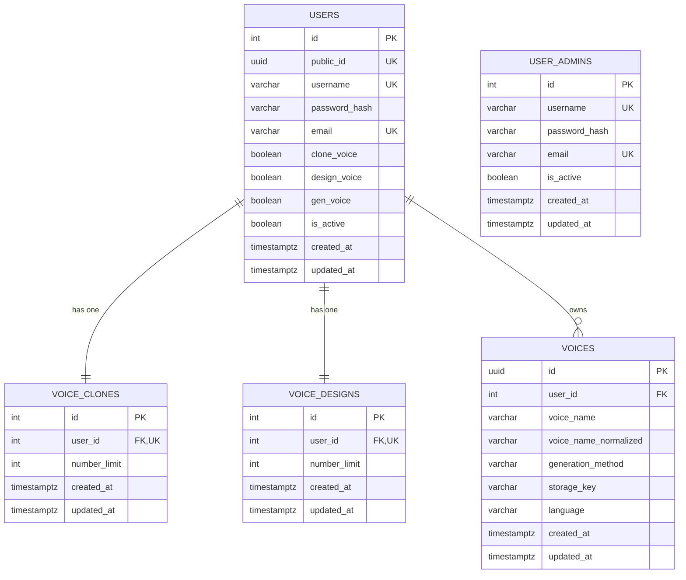

# 03. Cấu trúc database và liên kết bảng

Tài liệu này mô tả riêng cấu trúc PostgreSQL, quan hệ ORM và Alembic migration.

Tài liệu liên quan:

- [01_TONG_QUAN_VA_KIEN_TRUC.md](./01_TONG_QUAN_VA_KIEN_TRUC.md)
- [02_LOGIC_API.md](./02_LOGIC_API.md)

## 1. Tổng quan

Database hiện có các bảng nghiệp vụ:

- `users`
- `user_admins`
- `voice_clones`
- `voice_designs`
- `voices`

Alembic tự tạo thêm bảng `alembic_version` để theo dõi migration.

Không có bảng `voice_gens`. `gen_voice` là cột quyền trong `users`.

Audit log không lưu trong PostgreSQL. Mỗi request được ghi thành JSON Lines
trong `AUDIT_LOG_DIR`, phân file theo user. Vì vậy audit logging không yêu cầu
thêm migration hay bảng database.

## 2. Bảng `users`

Model: `User` trong `app/models/user.py`.

| Cột | Kiểu | Ràng buộc / mặc định | Ý nghĩa |
| --- | --- | --- | --- |
| `id` | Integer | Primary key | ID user |
| `public_id` | UUID | Unique, index, not null | ID công khai trả cho Voice API |
| `username` | Varchar(100) | Unique, index, not null | Tên đăng nhập lowercase |
| `password_hash` | Varchar(255) | Not null | Bcrypt hash |
| `email` | Varchar(255) | Unique, index, not null | Email lowercase |
| `clone_voice` | Boolean | Default false | Quyền Voice Clone |
| `design_voice` | Boolean | Default true | Quyền Voice Design |
| `gen_voice` | Boolean | Default true | Quyền Generate Voice |
| `is_active` | Boolean | Default false | Cho phép đăng nhập |
| `created_at` | Timestamp timezone | Default now | Thời gian tạo |
| `updated_at` | Timestamp timezone | Default now | Thời gian cập nhật |

`username` và `email` có unique index để ngăn dữ liệu trùng.

## 3. Bảng `user_admins`

Model: `UserAdmin` trong `app/models/user_admin.py`.

| Cột | Kiểu | Ràng buộc / mặc định | Ý nghĩa |
| --- | --- | --- | --- |
| `id` | Integer | Primary key | ID admin |
| `username` | Varchar(100) | Unique, index, not null | Tên đăng nhập admin |
| `password_hash` | Varchar(255) | Not null | Bcrypt hash riêng |
| `email` | Varchar(255) | Unique, index, not null | Email admin |
| `is_active` | Boolean | Default true | Cho phép đăng nhập quản trị |
| `created_at` | Timestamp timezone | Default now | Thời gian tạo |
| `updated_at` | Timestamp timezone | Default now | Thời gian cập nhật |

`user_admins` không có foreign key tới `users`. Hai loại tài khoản xác thực qua
endpoint và JWT `account_type` khác nhau.

## 4. Bảng `voice_clones`

Model: `VoiceClone` trong `app/models/voice.py`.

| Cột | Kiểu | Ràng buộc / mặc định | Ý nghĩa |
| --- | --- | --- | --- |
| `id` | Integer | Primary key | ID bản ghi |
| `user_id` | Integer | FK users.id, unique | User sở hữu limit |
| `number_limit` | Integer | Default 0 | Giới hạn Voice Clone |
| `created_at` | Timestamp timezone | Default now | Thời gian tạo |
| `updated_at` | Timestamp timezone | Default now | Thời gian cập nhật |

`user_id` là unique nên mỗi user chỉ có một bản ghi Voice Clone limit.

## 5. Bảng `voice_designs`

Model: `VoiceDesign` trong `app/models/voice.py`.

| Cột | Kiểu | Ràng buộc / mặc định | Ý nghĩa |
| --- | --- | --- | --- |
| `id` | Integer | Primary key | ID bản ghi |
| `user_id` | Integer | FK users.id, unique | User sở hữu limit |
| `number_limit` | Integer | Default 0 | Giới hạn Voice Design |
| `created_at` | Timestamp timezone | Default now | Thời gian tạo |
| `updated_at` | Timestamp timezone | Default now | Thời gian cập nhật |

`user_id` là unique nên mỗi user chỉ có một bản ghi Voice Design limit.

## 6. Bảng `voices`

Model: `Voice` trong `app/models/voice.py`.

| Cột | Kiểu | Ý nghĩa |
| --- | --- | --- |
| `id` | UUID PK | ID voice công khai |
| `user_id` | Integer FK | Chủ sở hữu nội bộ |
| `voice_name` | Varchar(150) | Tên hiển thị |
| `voice_name_normalized` | Varchar(150) | Tên casefold để unique |
| `generation_method` | Varchar(30) | `voice-clone` hoặc `voice-design` |
| `original_file_name` | Varchar(255), nullable | Tên audio gốc |
| `storage_key` | Varchar(500), nullable | Key file local/S3/MinIO |
| `audio_content_type` | Varchar(100), nullable | MIME audio |
| `audio_size` | Integer, nullable | Kích thước byte |
| `language` | Varchar(50), nullable | Design language |
| `gender` | Varchar(50), nullable | Design gender |
| `age` | Varchar(50), nullable | Design age |
| `pitch` | Varchar(80), nullable | Design pitch |
| `style` | Varchar(80), nullable | Design style |
| `english_accent` | Varchar(100), nullable | Accent tiếng Anh |
| `chinese_dialect` | Varchar(100), nullable | Phương ngữ tiếng Trung |
| `provider_metadata` | Text, nullable | Metadata provider tương lai |
| `created_at` | Timestamp timezone | Thời gian tạo |
| `updated_at` | Timestamp timezone | Thời gian cập nhật |

Ràng buộc:

- FK `user_id -> users.id ON DELETE CASCADE`.
- Unique `(user_id, voice_name_normalized)`.
- Check `generation_method IN ('voice-clone', 'voice-design')`.
- Một user có nhiều voice.

## 7. Bảng `alembic_version`

Bảng do Alembic quản lý:

- Lưu revision migration hiện tại.
- Không chỉnh sửa thủ công.
- Revision mới nhất hiện tại: `20260615_03`.

## 8. Sơ đồ liên kết



## 9. Chi tiết quan hệ

### `users` và `voice_clones`

- Quan hệ một-một.
- `voice_clones.user_id` tham chiếu `users.id`.
- `user_id` có unique index.
- Foreign key dùng `ON DELETE CASCADE`.

### `users` và `voice_designs`

- Quan hệ một-một.
- `voice_designs.user_id` tham chiếu `users.id`.
- `user_id` có unique index.
- Foreign key dùng `ON DELETE CASCADE`.

### ORM cascade

Trong model `User`, hai relationship dùng:

```python
cascade="all, delete-orphan"
```

Khi xóa user qua ORM, các bản ghi limit liên quan cũng được xóa.

### `users` và `voices`

- Quan hệ một-nhiều.
- Mọi voice thuộc đúng một user.
- Xóa user sẽ xóa metadata voice.
- File object cần được cleanup bởi service/storage lifecycle.
- Ownership API luôn lọc theo cả `voices.id` và `voices.user_id`.

## 10. Dữ liệu được tạo khi đăng ký

`register_user()` tạo trong cùng luồng:

1. Một bản ghi `users`.
2. Một bản ghi `voice_clones`.
3. Một bản ghi `voice_designs`.
4. `users.public_id` được sinh UUID.

Không tạo bản ghi `voices` cho đến khi user gọi API Clone hoặc Design.

Giá trị mặc định:

```text
users.clone_voice = false
users.design_voice = true
users.gen_voice = true
users.is_active = false

voice_clones.number_limit = DEFAULT_CLONE_VOICE_LIMIT
voice_designs.number_limit = DEFAULT_DESIGN_VOICE_LIMIT
```

## 11. Migration

### `20260613_01_initial_schema`

- Tạo `users`.
- Tạo `voice_clones`.
- Tạo `voice_designs`.
- Tạo unique index.
- Tạo foreign key và cascade delete.

### `20260614_02_add_gen_voice`

- Thêm:

  ```sql
  users.gen_voice BOOLEAN NOT NULL DEFAULT TRUE
  ```

- Đổi database default:

  ```sql
  users.design_voice DEFAULT TRUE
  ```

### `20260615_03_add_voice_library`

- Thêm `users.public_id`.
- Backfill UUID cho user cũ bằng `gen_random_uuid()`.
- Tạo bảng `voices`.
- Tạo ownership index, generation method index và unique name constraint.

### `20260619_04_separate_admin_users`

- Tạo bảng `user_admins` cùng unique index cho username và email.
- Sao chép các tài khoản cũ có `users.is_default=true` sang `user_admins`, giữ
  nguyên password hash và trạng thái active.
- Xóa cột `users.is_default` sau khi sao chép dữ liệu.
- Từ revision này, tài khoản user và admin xác thực độc lập.

## 12. Cập nhật schema khi deploy

Sau khi pull source mới:

```bash
source .venv/bin/activate
alembic upgrade head
alembic current
```

Revision cần đạt:

```text
20260619_04 (head)
```

Nếu không chạy migration, ORM có thể truy vấn cột chưa tồn tại và API trả
HTTP `503`.
